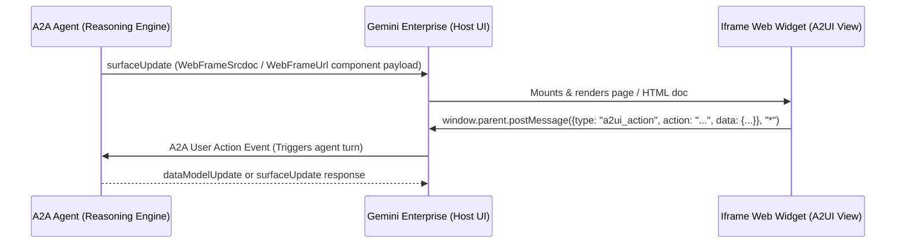

# A2UI Iframe Developer Skill

This skill provides comprehensive guidelines, architectural designs, code patterns, and API specifications for implementing custom iframe components (`WebFrameSrcdoc` and `WebFrameUrl`) in Agent-Driven User Interface (A2UI) agents within Gemini Enterprise.

---

## 1. Architectural Overview

Gemini Enterprise supports embedding custom web-based user interfaces inside the chat console. This allows agents to present rich, interactive, and pre-built widgets (like maps, calendars, dashboards, or ticket boards).



---

## 2. Choosing the Right Component

| Dimension | `WebFrameSrcdoc` | `WebFrameUrl` |
| :--- | :--- | :--- |
| **Primary Use Case** | Lightweight custom widgets, self-contained interactive UI, form controls, charts. | Embedding existing web apps, complex SPA frameworks (React/Vue), pages requiring network access. |
| **Network Access** | **Strictly Blocked** (`connect-src 'none'` CSP required). | **Allowed** (requires allowlisting target domain(s)). |
| **Hosting Requirement** | **None**. Inline HTML string is generated dynamically by the agent. | **Yes**. Code must be hosted externally (e.g., Cloud Run, Firebase Hosting). |
| **Security Boundaries** | High. Restricts cross-site scripting and external exfiltration. | Standard sandboxed iframe boundaries. |

---

## 3. Schema Definitions

These components are declared inside the `components` list of an A2UI `surfaceUpdate` message.

### 3.1 WebFrameSrcdoc Schema
```json
{
  "type": "OBJECT",
  "description": "Renders dynamic inline HTML inside a network-restricted iframe.",
  "properties": {
    "view_type": {
      "type": "STRING",
      "description": "Indicates the UI view template type (e.g., 'IssueTracker', 'UserProfile', 'AnalyticsChart').",
      "enum": ["IssueTracker", "UserProfile", "AnalyticsChart"]
    },
    "height": {
      "type": "NUMBER",
      "description": "The desired height of the iframe panel in pixels."
    },
    "srcdoc": {
      "type": "STRING",
      "description": "The raw HTML string containing inline CSS and JavaScript."
    }
  },
  "required": ["view_type", "srcdoc"]
}
```

### 3.2 WebFrameUrl Schema
```json
{
  "type": "OBJECT",
  "description": "Renders an external webpage via URL in a sandboxed iframe.",
  "properties": {
    "url": {
      "type": "OBJECT",
      "description": "Specifies the URL to load.",
      "properties": {
        "literalString": {
          "type": "STRING",
          "description": "The hardcoded target URL string."
        },
        "path": {
          "type": "STRING",
          "description": "JSON path to extract the URL from the data model (e.g., '/results/url')."
        }
      }
    },
    "height": {
      "type": "NUMBER",
      "description": "The height of the iframe in pixels."
    }
  },
  "required": ["url"]
}
```

---

## 4. Implementation Guidelines

### Step 1: Secure WebFrameSrcdoc with CSP
For any HTML sent via `WebFrameSrcdoc`, you **MUST** include the following Content Security Policy (CSP) tag in the `<head>` element:
```html
<meta http-equiv="Content-Security-Policy" content="connect-src 'none'">
```
> [!IMPORTANT]
> **Enforcement**: If this exact CSP meta tag is missing, Gemini Enterprise will block rendering of the component to prevent unauthorized data exfiltration.

### Step 2: Bidirectional Communication via `postMessage`
To trigger conversational updates or agent tool executions from within the iframe, implement a event listener inside the HTML page that calls `window.parent.postMessage`.

#### Iframe Frontend (JavaScript):
```javascript
function sendActionToAgent(actionName, payload) {
  window.parent.postMessage({
    type: 'a2ui_action',
    action: actionName,
    data: payload
  }, '*'); // Emit event to host window
}

// Example: User clicks on a location pin
document.getElementById('map-pin-1').addEventListener('click', () => {
  sendActionToAgent('selectStop', { stopId: 'stop_101', customer: 'Alice Johnson' });
});
```

#### Agent Backend (Python):
Define a tool or A2A action handler to process user events received via the host. Ensure the agent instruction guides the LLM on handling these interactions.

### Step 3: Agent System Instructions for A2UI Lifecycle
To ensure the LLM coordinates the A2UI state cycle correctly, inject the following prompt block into the agent's system instructions:

```text
A2UI INTERFACE RULES:
1. beginRendering: Use first to initialize a UI surface (e.g., surfaceId: "route_plan").
   - Root component ID MUST be identical to the entry point in surfaceUpdate.
2. surfaceUpdate: Emit to render components (buttons, text, WebFrameUrl, WebFrameSrcdoc).
   - Reuse the exact same surfaceId to update the existing view.
3. dataModelUpdate: Use to refresh variables in the UI without re-rendering the visual structure.
4. deleteSurface: Clean up the visual surface when the session ends or resets.
```

---

## 5. Reference Implementation (Google Maps Iframe Tool)

Below is a Python pattern for dynamically constructing a `WebFrameUrl` component for displaying routes via the Google Maps Embed API.

```python
import urllib.parse


def generate_maps_iframe_component(
    api_key: str, origin: str, destination: str, waypoints: list[str]
) -> dict:
    """
    Generates the A2UI component spec for an interactive Google Maps Embed iframe.
    """
    base_url = "https://www.google.com/maps/embed/v1/directions"

    # URL encode route parameters
    params = {
        "key": api_key,
        "origin": origin,
        "destination": destination,
    }
    if waypoints:
        params["waypoints"] = "|".join(waypoints)

    encoded_query = urllib.parse.urlencode(params)
    embed_url = f"{base_url}?{encoded_query}"

    return {
        "id": "route_map_iframe",
        "component": {
            "WebFrameUrl": {"url": {"literalString": embed_url}, "height": 450}
        },
    }
```

---

## 6. Troubleshooting & Best Practices

### 6.1 Viewport Sizing and Scrollbars
- **The Problem**: If a custom widget rendered inside `WebFrameSrcdoc` grows dynamically or contains fixed layout components, default iframe scrollbars will clutter the view console.
- **The Solution**: 
  - Ensure the outermost container inside your HTML `srcdoc` defines `box-sizing: border-box` and applies `overflow: hidden` if scrolling is handled internally.
  - Set the `height` attribute on the `WebFrameSrcdoc` component to a value that comfortably accommodates the content layout without triggering vertical scrollbars.
  - Test the layout using the **Local Tester** at standard browser resolutions (e.g., 1024x768 and 1440x900) to confirm visual stability.

### 6.2 Referrer Parameter Collision & Duplicate Parameter Priority
- **The Problem**: Some host environments (such as Gemini Enterprise) automatically append referrer arguments (like `&origin=https://vertexaisearch.cloud.google.com`) to the end of custom iframe URLs. If the embedded API uses the same query parameter key (e.g., `origin` in the Google Maps Directions Embed API), this results in a parameter collision, overriding the starting address.
- **Failed Workarounds**:
  - *Homoglyphs / Percent-Encoding (`ori%67in`)*: Pre-decoding URL parsing treats this literally as the key `ori%67in`, leaving the platform's appended `origin` to override the map.
  - *Trailing Hashes (`#`)*: Puts the platform's parameter in the hash fragment, but many map embeds actively parse the hash fragment for override arguments.
- **The Solution**:
  - Define your standard `origin=USER_STARTING_ADDRESS` parameter directly in the query parameters (near the start of the URL) and do **not** add a trailing `#`.
  - The browser/maps server will receive both occurrences of the parameter. Under standard HTTP/JS query parsing rules, the **first** occurrence (`origin=USER_STARTING_ADDRESS`) takes precedence, and the duplicate platform-appended origin is ignored.


