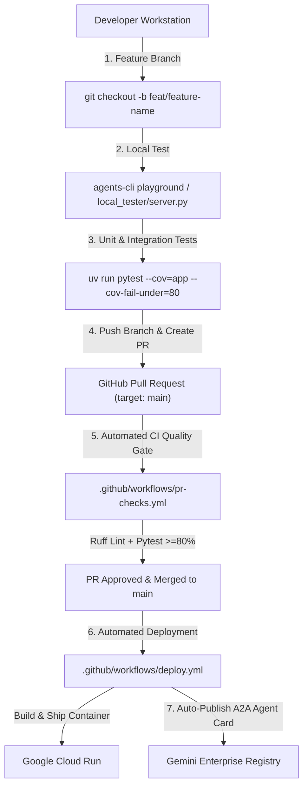

# Development & Deployment Flow Guide

This document defines the standardized development, testing, pull request (PR), and automated deployment workflow for the Cymbal Coffee Procurement Agent.

---

## Workflow Overview Architecture



---

## Phase 1: Local Development & Verification

Before opening a Pull Request, all work MUST be developed and tested locally.

### 1.1 Branch Naming Convention
- Feature branches: `feat/short-description` (e.g. `feat/ci-cd-flow-and-adr-alignment`)
- Bugfix branches: `fix/short-description` (e.g. `fix/a2ui-button-context`)

### 1.2 Interactive Local Verification Options

#### Option A: ADK Terminal & Web Playground
Interactive prompt testing and real-time tool execution trace inspection:
```bash
agents-cli playground
```

#### Option B: A2UI Visual Renderer Canvas
Web application canvas testing A2UI component cards, forms, and SVG telemetry charts:
```bash
uv run python local_tester/server.py
```
*(Open `http://localhost:8001/` in your browser)*

### 1.3 Local Pre-Flight Check
Run linting and unit test coverage checks before pushing:
```bash
uv run ruff check --fix .
uv run pytest --cov=app --cov-fail-under=80
```

---

## Phase 2: Pull Request Quality Gate (`pr-checks.yml`)

1. Push your feature branch to `origin`:
   ```bash
   git push origin feat/your-feature-name
   ```
2. Open a Pull Request targeting `main`.
3. GitHub Actions automatically executes `.github/workflows/pr-checks.yml`:
   - **Ruff Linting**: Validates code style and imports (`uv run ruff check .`).
   - **GCP Authentication**: Validates credentials via `google-github-actions/auth`.
   - **Test Suite**: Runs **47+ unit and integration tests** and enforces **>= 80% coverage**.

---

## Phase 3: Automated Deployment & Registry Sync (`deploy.yml`)

Once the Pull Request is reviewed and merged into `main`, GitHub Actions automatically executes `.github/workflows/deploy.yml`:

1. **Build & Deploy Container**: Ships the containerized A2A FastAPI app (`app/fast_api_app.py`) to Google Cloud Run (`cymbal-coffee-procurement-dashboard`).
2. **Synchronize Gemini Enterprise**: Automatically invokes `agents-cli publish gemini-enterprise` to refresh the A2A agent card (`/a2a/app/.well-known/agent-card.json`) in Gemini Enterprise.
3. **Enforce ALL_USERS Sharing Scope**: Enforces `"sharingConfig": { "scope": "ALL_USERS" }` via Discovery Engine API so the agent immediately appears in end-user sidebars and agent pickers without requiring manual admin intervention.

---

## Related ADR Documents
- [ADR-001: A2UI Schema Compatibility & Renderer Design](file:///var/home/wtg/Repos/cymbal-coffee-procurement-agent/docs/adr/ADR-001-A2UI-Schema-Compatibility-and-Renderer-Design.md)
- [ADR-002: Cloud Run Health Probing & Custom Catalog Visualizations](file:///var/home/wtg/Repos/cymbal-coffee-procurement-agent/docs/adr/ADR-002-Cloud-Run-Health-Probing-and-Custom-Catalog-Visualizations.md)
- [ADR-003: Automated CI/CD Deployment via GitHub Actions](file:///var/home/wtg/Repos/cymbal-coffee-procurement-agent/docs/adr/ADR-003-Automated-CI-CD-Deployment-via-GitHub-Actions.md)
